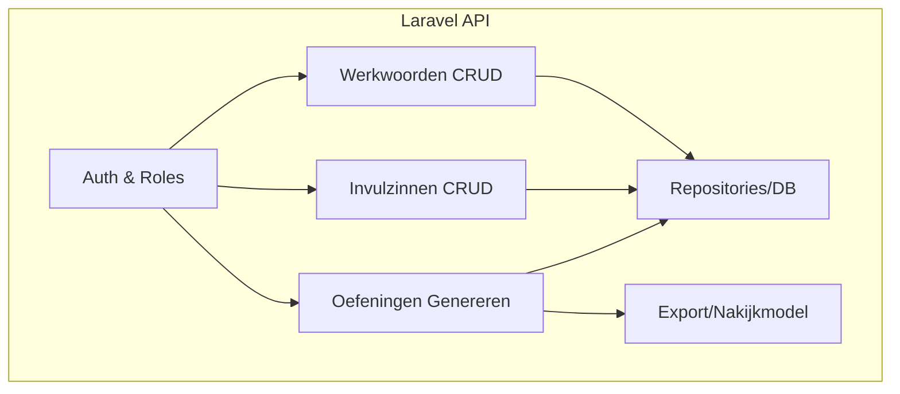
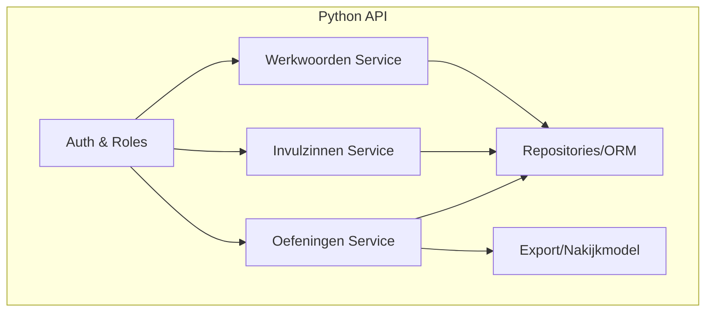
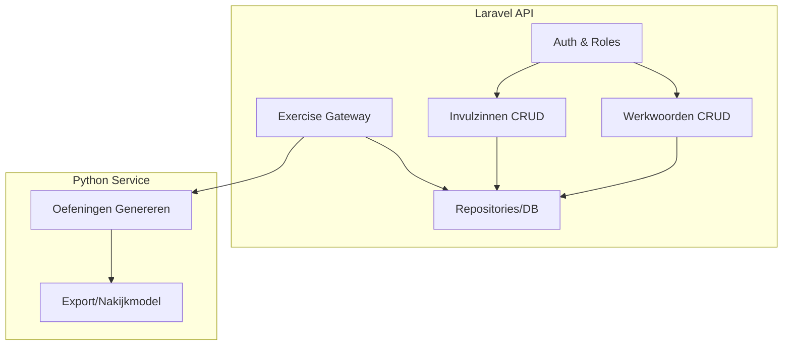

# Component Diagram (opties)

## Optie A: Laravel API

```mermaid
flowchart TB
    subgraph Laravel API
      Auth[Auth & Roles]
      Verbs[Werkwoorden CRUD]
      Exercises[Oefeningen Genereren]
      Sentences[Invulzinnen CRUD]
      Exports[Export/Nakijkmodel]
      Repo[Repositories/DB]
    end

    Auth --> Verbs
    Auth --> Sentences
    Auth --> Exercises
    Exercises --> Repo
    Verbs --> Repo
    Sentences --> Repo
    Exercises --> Exports
```

## Optie B: Python API (FastAPI/Django)

```mermaid
flowchart TB
    subgraph Python API
      Auth[Auth & Roles]
      Verbs[Werkwoorden Service]
      Exercises[Oefeningen Service]
      Sentences[Invulzinnen Service]
      Exports[Export/Nakijkmodel]
      Repo[Repositories/ORM]
    end

    Auth --> Verbs
    Auth --> Sentences
    Auth --> Exercises
    Exercises --> Repo
    Verbs --> Repo
    Sentences --> Repo
    Exercises --> Exports
```

## Optie C: Hybrid (Laravel API + Python Service)

```mermaid
flowchart TB
    subgraph Laravel API
      Auth[Auth & Roles]
      Verbs[Werkwoorden CRUD]
      Sentences[Invulzinnen CRUD]
      Gateway[Exercise Gateway]
      Repo[Repositories/DB]
    end

    subgraph Python Service
      Exercises[Oefeningen Genereren]
      Exports[Export/Nakijkmodel]
    end

    Auth --> Verbs
    Auth --> Sentences
    Gateway --> Exercises
    Exercises --> Exports
    Verbs --> Repo
    Sentences --> Repo
    Gateway --> Repo
```
