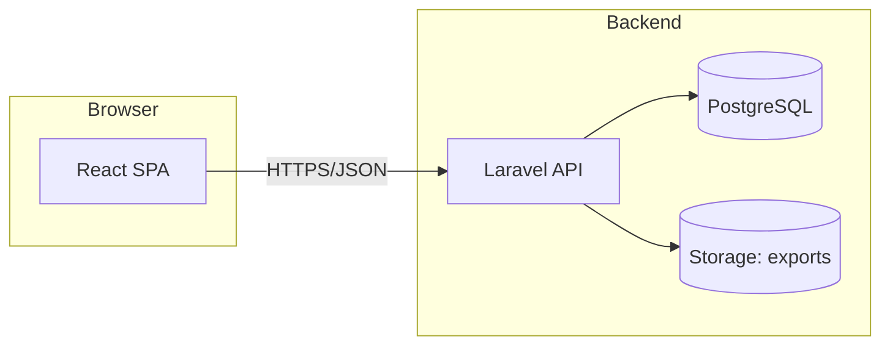
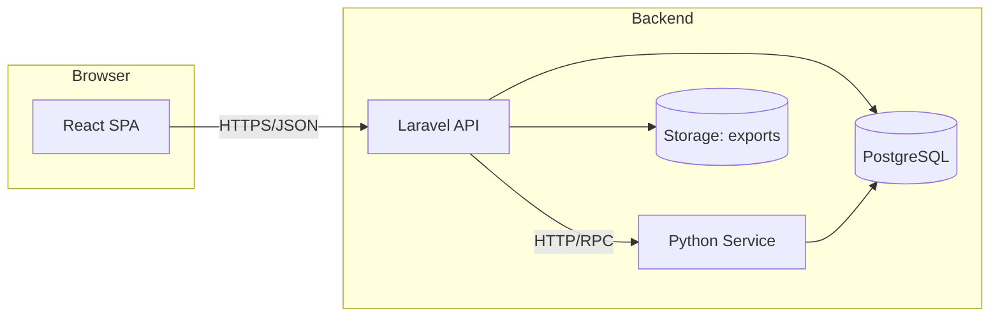

# Container Diagram (opties)

## Doel
Vergelijking van twee architectuurroutes met een React SPA.

## Optie A: Laravel API + React SPA


## Optie B: Python API + React SPA
```mermaid
flowchart LR
    subgraph Browser
      SPA[React SPA]
    end

    subgraph Backend
      API[Python API (FastAPI of Django)]
      DB[(PostgreSQL)]
      Files[(Storage: exports)]
    end

    SPA -->|HTTPS/JSON| API
    API --> DB
    API --> Files
```

## Optie C: Hybrid (Laravel API + Python Service)


## Notities
- Exports (PDF/Markdown) hangen aan de API‑laag.
- Auth/roles kunnen in API‑laag of via externe auth provider.
- Hybrid is krachtig maar introduceert extra deployment‑complexiteit.
