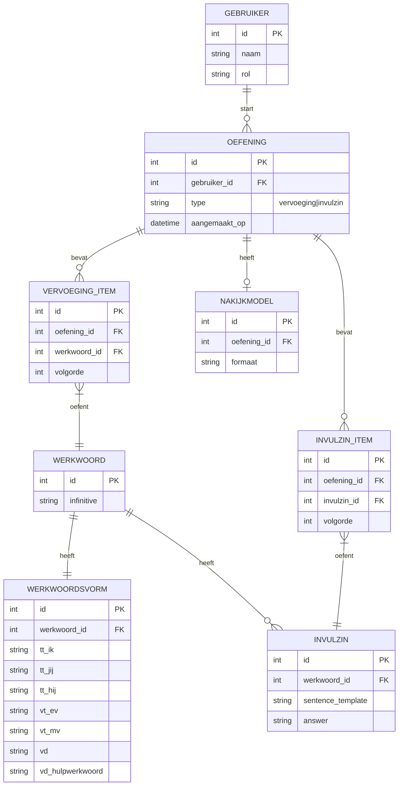

# ERD (concept)

## Doel
Relaties en gegevensstructuur voor de eerste versie (zonder thema’s/badges/logging).

## Entiteiten
- gebruiker
- werkwoord
- werkwoordsvorm
- oefening
- invulzin
- vervoeging_item
- invulzin_item
- nakijkmodel

## Relaties (conceptueel)
- gebruiker 1..* oefening
- oefening 1..* vervoeging_item (alleen als type=vervoeging)
- oefening 1..* invulzin_item (alleen als type=invulzin)
- oefening 0..1 nakijkmodel
- werkwoord 1..1 werkwoordsvorm
- werkwoord 1..* invulzin
- vervoeging_item *..1 werkwoord
- invulzin_item *..1 invulzin

## Diagram (Mermaid)

## Notities
- `OEFENING.type` bepaalt of er `VERVOEGING_ITEM` of `INVULZIN_ITEM` records zijn.
- Dit maakt de relatie tussen oefeningstype en het bijbehorende item expliciet.
- `NAKIJKMODEL` kan simpelweg een export‑record zijn in MVP; details kunnen later worden toegevoegd.
- Rollen kunnen simpel (string) in MVP, later uitbreiden naar tabel.
