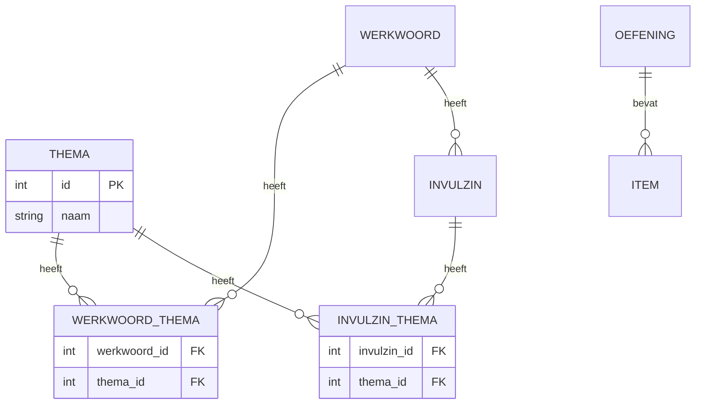

# Conceptueel model

Thema, selectie en relaties. Zie [open-vragen.md](open-vragen.md) voor gemaakte keuzes. Voor het volledige v4-datamodel: [erd.md](erd.md).

---

## Entiteiten

- **Thema** — Naam/label (bijv. "beweging", "les 5"). Optioneel: beschrijving, volgorde.
- **Werkwoord** — Infinitief, werkwoordsvormen; zie [erd.md](erd.md).
- **Invulzin** — sentence_template, answer, gekoppeld aan werkwoord; zie [erd.md](erd.md).
- **Oefening** — Type vervoeging/invulzin, items, nakijkmodel; zie [erd.md](erd.md).
- **Item** — Vervoeging-item of invulzin-item; zie [erd.md](erd.md).

---

## Relaties

- **Werkwoord ↔ Thema** — m:n. Een werkwoord kan bij meerdere thema's horen; een thema heeft meerdere werkwoorden. Implementatie: koppeltabel (bijv. werkwoord_thema) of M2M.
- **Invulzin ↔ Thema** — m:n. Een invulzin kan bij meerdere thema's horen; een thema heeft meerdere invulzinnen.
- **Oefening ↔ Selectie** — Een oefening wordt gegenereerd "uit" een selectie. Selectie = de keuze bij genereren: werkwoorden (expliciet of via thema), eventueel expliciete zinnen. Geen aparte Selectie-entiteit in eerste versie; parameters bij genereren (bijv. thema_id + aantal items, of werkwoord_ids + aantal items).

---

## Diagram

*(Volledige entiteiten en overige relaties staan in [erd.md](erd.md).)*

---

## Gegevens voor filter op thema

- **Bij beheer (Fase 2/3):** Lijst thema's; per thema werkwoorden en/of zinnen tonen. Filter op thema en/of werkwoord in één scherm; zoeken op infinitief. Eerste keuze in UI: thema als filter.
- **Bij genereren (Fase 1/2):** Selectie op werkwoorden (expliciet) en/of thema; aantal items. Richtlijn: minimaal 5 items voor voldoende oefenlengte.

Zie [fasering.md](fasering.md) voor Fase 1–4.
