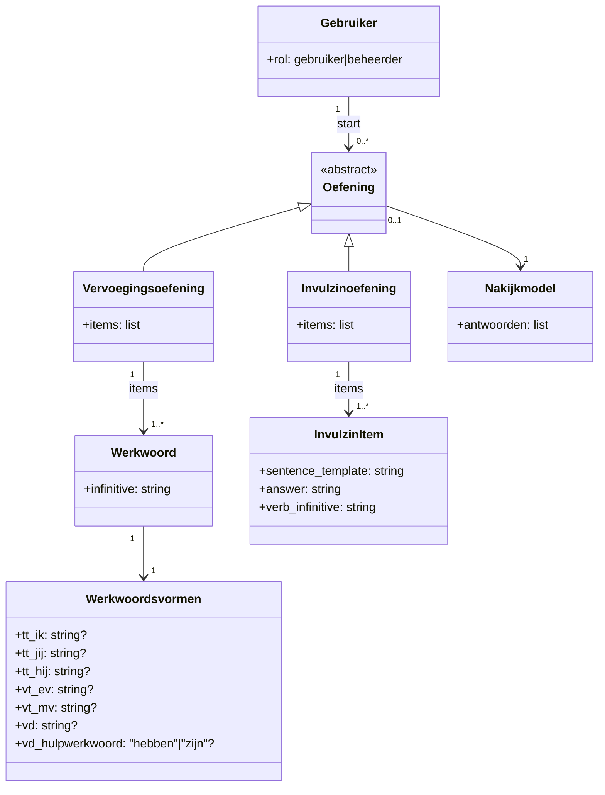

Oorspronkelijk: archive/v3/domeindiagram.md

# Domeindiagram (concept)

## Doel
De app helpt gebruikers Nederlandse werkwoordsvormen leren en oefenen. De kernfunctionaliteit is:
- werkwoorden en hun vervoegingen beheren
- vervoegingsoefening: alle werkwoordsvormen invullen per werkwoord
- invulzin‑oefening: werkwoord invullen in een zin met invulplek
- nakijkmodel (antwoorden) genereren zodat gebruikers kunnen controleren
- oefeningen kunnen invullen in een interface of als PDF uitdraaien

Later kan het domein uitbreiden met o.a. thema's/badges, idioom en andere activiteitstypen, maar dat is nu out‑of‑scope.

## Domeinbegrippen (simpel en concreet)
- Gebruiker
  - Kan oefenen (leerling) of beheren (beheerder)
- Werkwoord
  - Infinitief met alle vormen
- Oefening (abstract)
  - Wordt door een gebruiker gestart
  - Heeft type: vervoegingsoefening of invulzin‑oefening
- Vervoegingsoefening
  - Een lijst werkwoorden waarvoor alle vormen ingevuld worden
  - Kan als PDF oefening + nakijkvel worden gegenereerd
- Invulzin‑oefening
  - Een lijst zinnen met invulplek, telkens met een vraag en correct antwoord
- Invulzin‑item
  - Een zin met invulplek + het juiste antwoord
- Nakijkmodel
  - Antwoorden behorend bij een oefening

## Relaties (concreet)
- Een gebruiker start 0..* oefeningen.
- Een oefening is óf een vervoegingsoefening óf een invulzin‑oefening (niet beide).
- Een vervoegingsoefening bevat 1..* werkwoorden.
- Een invulzin‑oefening bevat 1..* invulzin‑items.
- Een werkwoord heeft 1 set werkwoordsvormen.
- Elke oefening kan een nakijkmodel hebben.

## Diagram (Mermaid)

Voor thema en koppelingen werkwoord–thema, invulzin–thema: zie [conceptueel-model.md](conceptueel-model.md) en [erd.md](erd.md).

## Buiten scope (voor nu)

In v4 zijn **thema's** wél in scope; zie [conceptueel-model.md](conceptueel-model.md) en [terminologie.md](terminologie.md). Overige punten (idioom, voortgang, AI als dynamische oefen-generator) blijven buiten scope of later.

- Idioom en andere taalonderdelen
- Voortgang, scores of gebruikersprofielen (zie [docs/voortgang-tracking.md](../docs/voortgang-tracking.md) voor later)
- AI als dynamische oefen‑generator (AI is in v4 enkel invoerhulp; zie [adr/adr-llm.md](adr/adr-llm.md))
