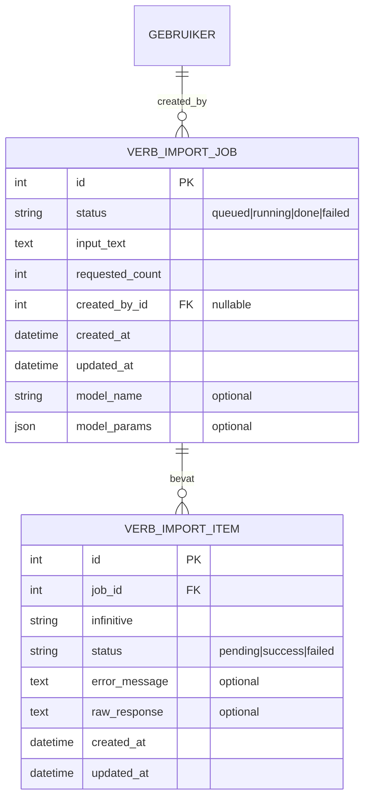

# Epic 7: Datamodel — Import jobs en items

## Doel

Exacte velden en relaties voor de LLM bulk-import (Epic 7). Implementatie van migrations en Django-modellen is een 1-op-1 vertaling van deze specificatie.

Bestaande modellen en ERD: [../erd.md](../erd.md), [../../backend/verbs/models.py](../../backend/verbs/models.py) (Verb, VerbForm, FillInSentence).

---

## Nieuwe entiteiten

### VerbImportJob

Een bulk-importaanvraag: één job per "Start generatie"-actie van de beheerder.

| Veld | Type | Verplicht | Toelichting |
|------|------|-----------|-------------|
| id | PK | — | Auto. |
| status | CharField (max 20) | Ja | `queued`, `running`, `done`, `failed`. |
| input_text | TextField | Ja | Ruwe invoer (textarea): werkwoorden per regel of comma-separated. |
| requested_count | PositiveIntegerField | Ja | Aantal unieke werkwoorden (aantal items). |
| created_by | FK User | Nee | Beheerder die de job startte (nullable). |
| created_at | DateTimeField | Ja | auto_now_add. |
| updated_at | DateTimeField | Ja | auto_now. |
| model_name | CharField (max 100) | Nee | Bijv. `gpt-4o-mini`; voor reproduceerbaarheid. |
| model_params | JSONField of TextField | Nee | Optionele parameters (temperature, max_tokens, etc.). |

- **Unieke constraint:** geen (meerdere jobs na elkaar toegestaan).
- **Index:** bijvoorbeeld op `created_at` voor sortering (laatste eerst).

---

### VerbImportItem

Eén werkwoord binnen een job; na verwerking success of failed met foutdetails.

| Veld | Type | Verplicht | Toelichting |
|------|------|-----------|-------------|
| id | PK | — | Auto. |
| job | FK VerbImportJob (CASCADE) | Ja | De job waartoe dit item hoort. |
| infinitive | CharField (max 100) | Ja | Het werkwoord (infinitief). |
| status | CharField (max 20) | Ja | `pending`, `success`, `failed`. |
| error_message | TextField | Nee | Samenvatting validatie- of API-fout (blank als success). |
| raw_response | TextField | Nee | Ruwe LLM-response voor troubleshooting (blank als niet opgeslagen). |
| created_at | DateTimeField | Ja | auto_now_add. |
| updated_at | DateTimeField | Ja | auto_now. |

- **Unieke constraint:** `UniqueConstraint(job, infinitive)` — één item per werkwoord per job.
- **Relatie:** Geen FK van Item naar Verb. Na succes wordt Verb/VerbForm (en eventueel FillInSentence) via `update_or_create` op basis van `infinitive` aangemaakt; het item blijft verwijzen naar de string `infinitive`.

---

## Relatie met bestaande modellen

- **Verb / VerbForm:** Na succesvolle verwerking van een item: `update_or_create(Verb, infinitive=item.infinitive, defaults=...)` en bijbehorende VerbForm. Idempotent op `Verb.infinitive` (unique).
- **FillInSentence:** Gegenereerde zinnen worden opgeslagen als bestaande entiteit [FillInSentence](../../backend/verbs/models.py): `verb`, `sentence_template`, `answer`, `answer_form_key`. Geen aparte "ExampleSentence"-tabel in de standaardkeuze (zie hieronder).

---

## Optioneel: ExampleSentence

Als je gegenereerde zinnen eerst als aparte "voorbeeldzin"-entiteit wilt bewaren (bijv. voor review voordat ze als invulzin worden overgenomen), kan een apart model gebruikt worden:

| Veld | Type | Toelichting |
|------|------|-------------|
| id | PK | Auto. |
| verb | FK Verb (CASCADE) | Werkwoord. |
| text | CharField (255–500) of TextField | De zin. |
| tense | CharField (optioneel) | Bijv. tt/vt/vd. |
| level | CharField (optioneel) | Bijv. niveau. |
| source_model | CharField (optioneel) | Modelnaam voor traceability. |
| created_at | DateTimeField | auto_now_add. |

**Standaardkeuze in dit epic:** Geen aparte ExampleSentence; gegenereerde zinnen direct als **FillInSentence** opslaan met `sentence_template`, `answer` en `answer_form_key` ingevuld. Dat sluit aan op het bestaande ERD en [Epic 3](epic-3-invulzinnen-beheren.md).

---

## ERD-aanvulling

De volgende entiteiten komen bij het bestaande [../erd.md](../erd.md) (concept) voor Epic 7:

- **GEBRUIKER** verwijst naar het bestaande gebruikersmodel (bijv. `accounts.User`).
- Er is geen directe FK van VERB_IMPORT_ITEM naar WERKWOORD; de koppeling verloopt via de string `infinitive` en de applicatielaag (update_or_create Verb/VerbForm en FillInSentence).

---

## Referenties

- [../erd.md](../erd.md) — bestaand ERD (WERKWOORD, WERKWOORDSVORM, INVULZIN).
- [../../backend/verbs/models.py](../../backend/verbs/models.py) — Verb, VerbForm, FillInSentence, VdHulp, AnswerFormKey.
- [epic-7-llm-bulk-import.md](epic-7-llm-bulk-import.md) — overzicht Epic 7.
