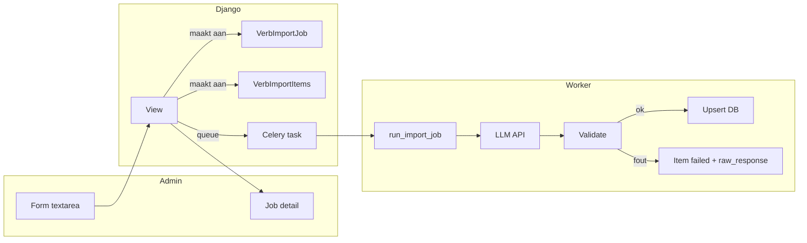
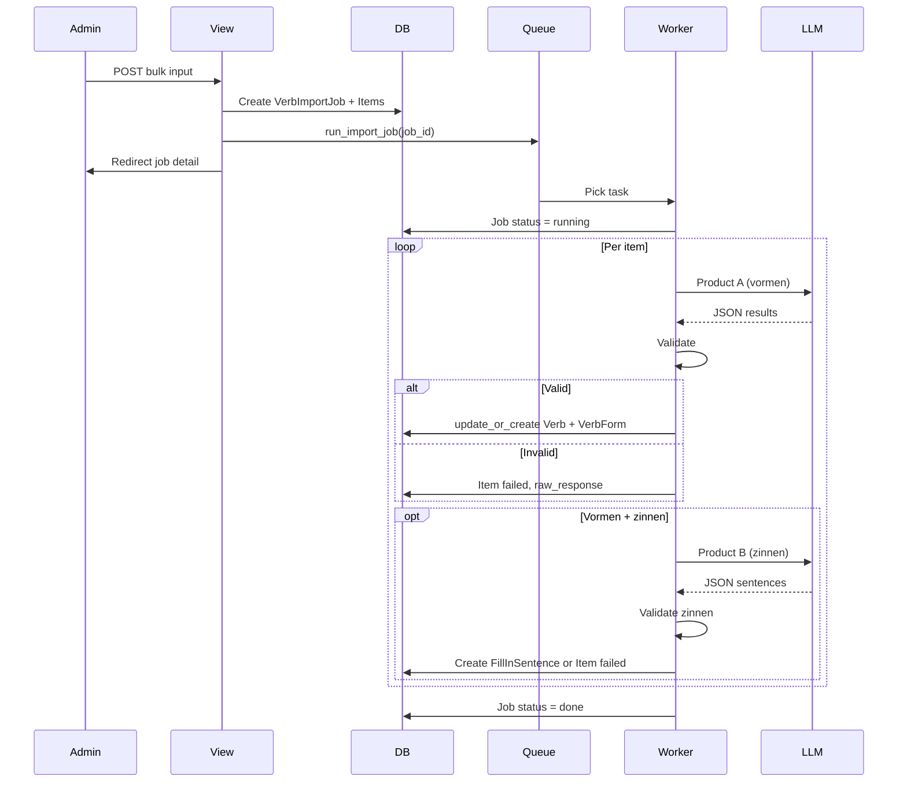

# Epic 7: Technisch overzicht — flow en componenten

## Doel

Eén beeld voor ontwikkelaars: volgorde van stappen, verantwoordelijke componenten en infra. Gebruikt het [datamodel](epic-7-datamodel-import.md) en de [LLM-contracten](epic-7-llm-contracts.md).

---

## Flow (stappen)

1. **Admin submit** — Beheerder vult het bulk-formulier in (textarea: werkwoorden per regel of comma-separated) en klikt "Start generatie" (eventueel met optie "Alleen vormen" of "Vormen + zinnen").
2. **View** — Ontvangt de POST; maakt één **VerbImportJob** aan (status `queued`) en voor elke unieke infinitive één **VerbImportItem** (status `pending`). Triggert een **Celery-task** met `job_id`. Response: redirect naar job-detailpagina of melding "Job gestart".
3. **Worker** — Task `run_import_job(job_id)` start; zet job status op `running`. Voor elk item (of per batch voor product A):
   - **LLM-vormen-call** (product A): batch van infinitieven naar API; response parsen.
   - **Validatie vormen:** Regels uit [epic-7-validatie.md](epic-7-validatie.md); bij fout: item status `failed`, error_message + raw_response; volgende item.
   - **Bij succes:** `update_or_create` Verb + VerbForm op basis van infinitive en vormvelden.
   - **Indien "vormen + zinnen":** Per werkwoord **LLM-zinnen-call** (product B) met infinitive + opgeslagen vormen; response parsen; **validatie zinnen**; bij succes: FillInSentence-records aanmaken (sentence_template, answer, answer_form_key); bij fout: item op failed met error_message + raw_response.
   - Item status bij succes: `success`.
4. **Na alle items** — Job status = `done`. Als alle items failed zijn, kan job status eventueel `failed` worden gezet (implementatiekeuze).

---

## Componenten

| Component | Verantwoordelijkheid |
|-----------|----------------------|
| **Django admin** | Custom form (textarea, optie alleen vormen / vormen + zinnen); custom view voor job-detail (status, counts, lijst items met status/fouten, optioneel raw_response). Geen businesslogica in views: alleen aanroep van services of tasks. |
| **Celery** | Eén task (bijv. `verbs.tasks.run_import_job`). Ontvangt `job_id`; haalt job + items op; roept service-laag aan per item of per batch; bij transiente API-fouten: retry met backoff. |
| **Service-laag** | OpenAI-client (env `OPENAI_API_KEY`); functies voor product A (vormen batch) en product B (zinnen per werkwoord) volgens [epic-7-llm-contracts.md](epic-7-llm-contracts.md); validatie volgens [epic-7-validatie.md](epic-7-validatie.md); upsert Verb/VerbForm en aanmaken FillInSentence. Geen Celery- of request-specifieke logica. |

---

## Infra

- **Broker:** Redis (of andere Celery-broker) voor de task queue.
- **Celery worker:** Draait naast de Django-app; voert `run_import_job` uit.
- **Env:** `OPENAI_API_KEY` (verplicht voor LLM-calls); optioneel `OPENAI_VERB_MODEL` (default: gpt-4o-mini).

---

## Flowdiagram

Vereenvoudigd sequence (hoofdstroom):

---

## Referenties

- [epic-7-datamodel-import.md](epic-7-datamodel-import.md) — VerbImportJob, VerbImportItem.
- [epic-7-llm-contracts.md](epic-7-llm-contracts.md) — Product A en B.
- [epic-7-validatie.md](epic-7-validatie.md) — Validatieregels.
- [../adr/adr-llm.md](../adr/adr-llm.md) — Beslissingen OpenAI, Celery, twee calls.
