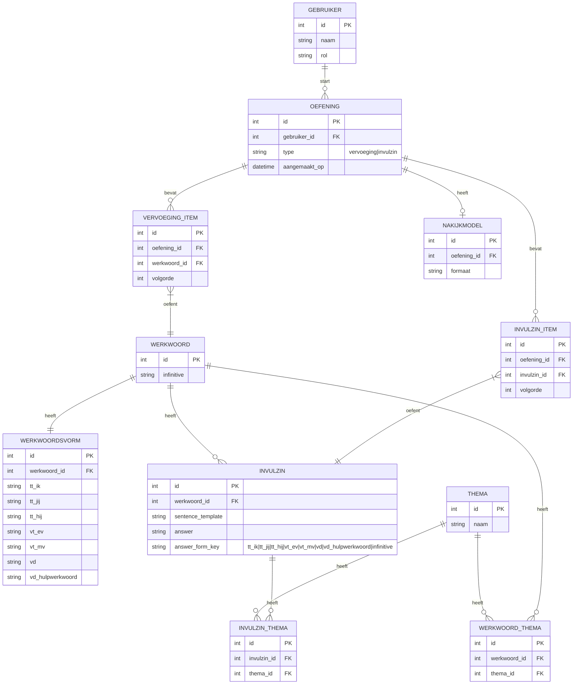

# ERD (v4)

## Doel

Relaties en gegevensstructuur voor v4: basis zoals v3, uitgebreid met **thema** en m:n-koppeling werkwoord–thema en invulzin–thema. Zie [conceptueel-model.md](conceptueel-model.md) en [terminologie.md](terminologie.md). Gebaseerd op archive/v3/erd.md; v4 uitgebreid met thema en koppeltabellen.

## Entiteiten

- gebruiker
- werkwoord
- werkwoordsvorm
- oefening
- invulzin
- vervoeging_item
- invulzin_item
- nakijkmodel
- **thema**
- **werkwoord_thema** (koppeltabel m:n)
- **invulzin_thema** (koppeltabel m:n)

## Relaties (conceptueel)

- gebruiker 1..* oefening
- oefening 1..* vervoeging_item (alleen als type=vervoeging)
- oefening 1..* invulzin_item (alleen als type=invulzin)
- oefening 0..1 nakijkmodel
- werkwoord 1..1 werkwoordsvorm
- werkwoord 1..* invulzin
- vervoeging_item *..1 werkwoord
- invulzin_item *..1 invulzin
- **werkwoord m..n thema** (via werkwoord_thema)
- **invulzin m..n thema** (via invulzin_thema)

## Diagram (Mermaid)

## Notities

- `OEFENING.type` bepaalt of er `VERVOEGING_ITEM` of `INVULZIN_ITEM` records zijn.
- **Selectie:** Geen aparte Selectie-entiteit; de keuze (werkwoorden, thema, aantal items) is parameter bij het genereren van een oefening (zie [fasering.md](fasering.md) Fase 1–2).
- `NAKIJKMODEL` kan simpelweg een export-record zijn in MVP; details kunnen later worden toegevoegd.
- Rollen kunnen simpel (string) in MVP, later uitbreiden naar tabel.

## Uitbreiding: tracking (na MVP)

Voor voortgang (wat gedaan, beheerst, te herhalen) en later pad/curriculum:

- **ExerciseAttempt:** exercise (FK), user (FK), started_at, completed_at (nullable).
- **ConjugationItemAnswer:** attempt (FK), conjugation_item (FK), gegeven antwoorden per vorm + correctheid.
- **FillInSentenceItemAnswer:** attempt (FK), fill_in_sentence_item (FK), given_answer, is_correct.

Volledig voorstel: [docs/voortgang-tracking.md](../docs/voortgang-tracking.md).
